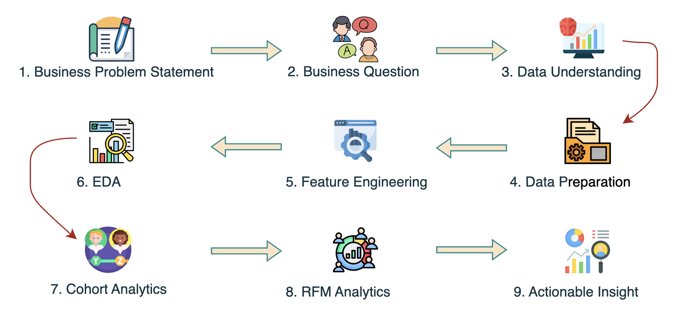

# Customer Analytics & Segmentation for an Online Retail Business

    

# **1. Executive Summary**  

This project analyzes customer purchasing behavior using **Exploratory Data Analysis (EDA), Cohort Analysis, and RFM Segmentation** on the Online Retail dataset.

The objective is to identify high-value customers, measure customer retention, understand purchasing patterns, and uncover revenue growth opportunities.

The analysis reveals three key business insights:

- Customer retention declines significantly after the first purchase.
- Purchasing behavior is highly seasonal, with demand concentrated during the holiday period.
- A relatively small group of loyal customers generates the majority of customer value.

Based on these findings, the project proposes data-driven CRM strategies to improve customer retention, increase Customer Lifetime Value (CLV), and optimize marketing investment.     

# **2. Business Problem**

The company has accumulated a large volume of transactional data but lacks a clear understanding of customer purchasing behavior and long-term customer value. Without customer segmentation and retention analysis, it is difficult to identify high-value customers, improve marketing effectiveness, and develop targeted CRM strategies.This project addresses these challenges by analyzing customer transactions to uncover purchasing patterns, evaluate customer retention, segment customers based on RFM, and provide data-driven recommendations for improving customer loyalty and maximizing revenue.

**Business Questions**

- Who are the most valuable customers?
- Which customer segments generate the highest revenue?
- How well are customers retained over time?
- Which customer cohorts show the strongest loyalty?
- How can customer segmentation support more effective CRM strategies?

# **3. Dataset Overview**

## **About this file**
This dataset was collected and made available by Dr. Daqing Chen, Director of Public Analytics Group at the School of Engineering and Mathematical Sciences, City University, London. It was contributed to the UCI Machine Learning Repository in December 2010.

The dataset consists of transactional data from a UK-based online retailer that mainly sells unique all-occasion gifts. The transactions span from December 1, 2010, to December 9, 2011. The data includes sales of over 500,000 transactions, reflecting product purchases made by customers in various countries, with a focus on non-store purchases.

**Key Features:**
- InvoiceNo: The invoice number associated with the transaction. A numeric identifier for each transaction.
- StockCode: The code of the purchased product. A unique identifier for each product.
- Description: A brief description of the product.
- Quantity: The quantity of each product purchased per transaction.
- InvoiceDate: The date and time when the transaction was generated.
- UnitPrice: The unit price of the product.
- CustomerID: A unique identifier for the customer.
- Country: The country from which the customer made the purchase.

**Purpose and Usage:**
This dataset can be utilized for a variety of purposes, including but not limited to:
- Customer Segmentation: Analyzing purchasing patterns to classify customers based on their buying behavior.
- Product Recommendation: Developing recommendation systems based on the purchase history.
- Sales Forecasting: Predicting future sales based on historical data trends.
- Market Basket Analysis: Identifying associations between products frequently bought together.

**Researchers and practitioners** can leverage this dataset to build and test machine learning models related to sales prediction, customer retention, and inventory management.
# **4. Analysis Workflow**
Analysis Pipeline (workflow diagram)
Tools & Technologies

# **5. EDA**
## 5.1 Sales Performance
Revenue Trend
Order Trend
## 5.2 Customer Behavior
Customer Distribution
Purchase Frequency
## 5.3 Product Performance
Best-selling Products
Revenue Contribution
## 5.4 Key Findings

# **6. Cohort Analysis**

# **7. RFM Segmentation**

# **8. Business Recommendations**

