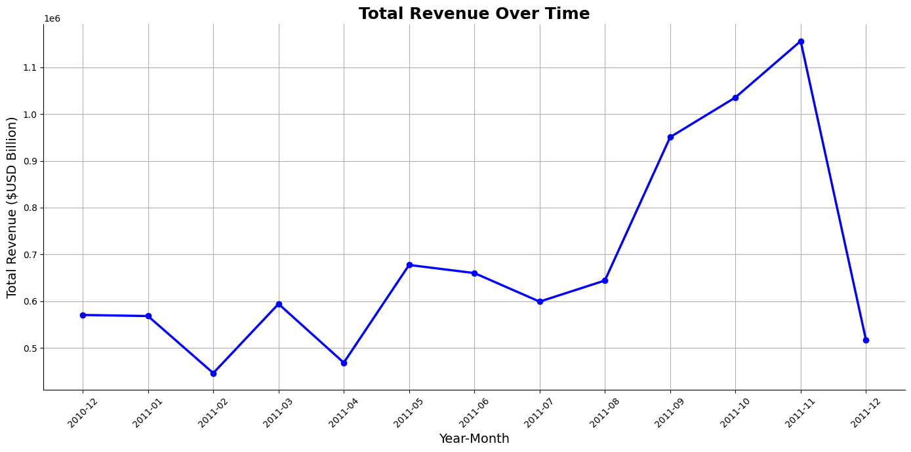
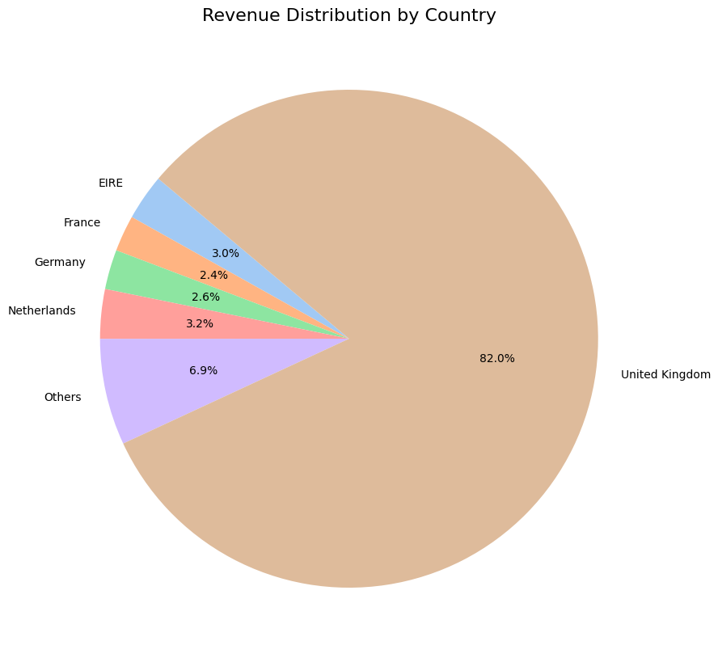
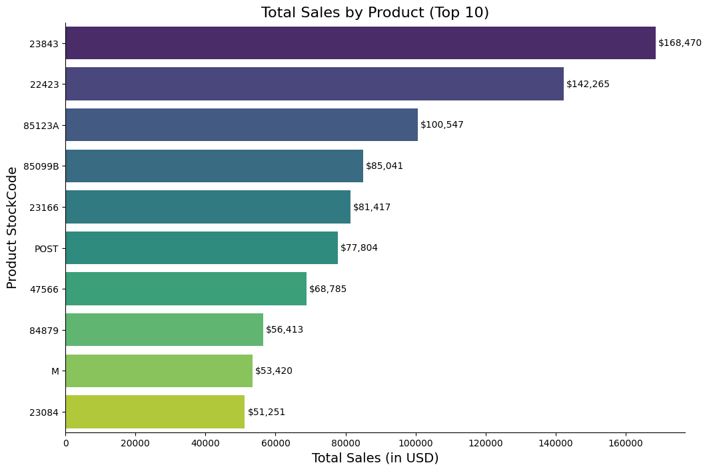
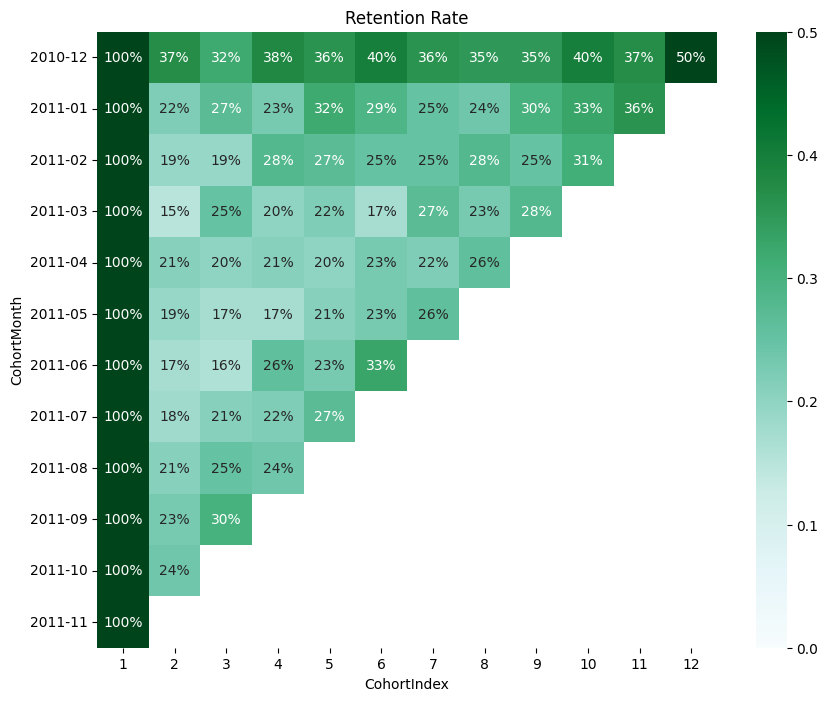
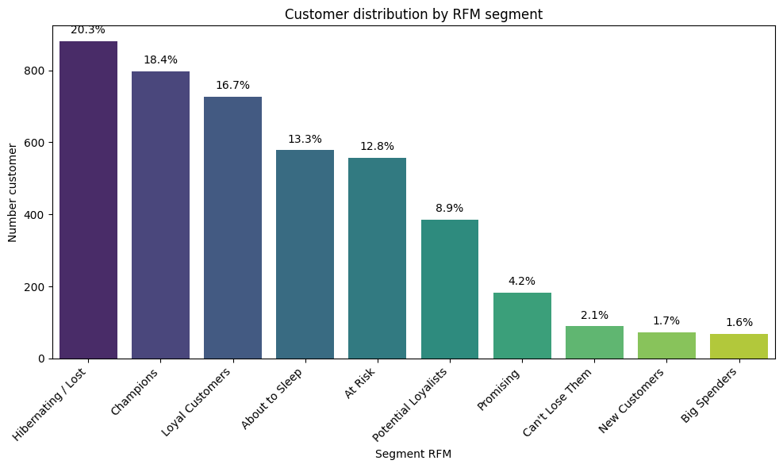

# Customer Analytics & Segmentation for an Online Retail Business

    

# **1. Executive Summary**  

This project analyzes customer purchasing behavior using **Exploratory Data Analysis (EDA), Cohort Analysis, and RFM Segmentation** on the Online Retail dataset.

The objective is to identify high-value customers, measure customer retention, understand purchasing patterns, and uncover revenue growth opportunities.

The analysis reveals three key business insights:

- Customer retention declines significantly after the first purchase.
- Purchasing behavior is highly seasonal, with demand concentrated during the holiday period.
- A relatively small group of loyal customers generates the majority of customer value.

Based on these findings, the project proposes data-driven CRM strategies to improve customer retention, increase Customer Lifetime Value (CLV), and optimize marketing investment.     

# **2. Business Problem**

The company has accumulated a large volume of transactional data but lacks a clear understanding of customer purchasing behavior and long-term customer value. Without customer segmentation and retention analysis, it is difficult to identify high-value customers, improve marketing effectiveness, and develop targeted CRM strategies.This project addresses these challenges by analyzing customer transactions to uncover purchasing patterns, evaluate customer retention, segment customers based on RFM, and provide data-driven recommendations for improving customer loyalty and maximizing revenue.

**Business Questions**

- Who are the most valuable customers?
- Which customer segments generate the highest revenue?
- How well are customers retained over time?
- Which customer cohorts show the strongest loyalty?
- How can customer segmentation support more effective CRM strategies?

# **3. Data Understanding**

## **About this file**
This dataset was collected and made available by Dr. Daqing Chen, Director of Public Analytics Group at the School of Engineering and Mathematical Sciences, City University, London. It was contributed to the UCI Machine Learning Repository in December 2010.

The dataset consists of transactional data from a UK-based online retailer that mainly sells unique all-occasion gifts. The transactions span from December 1, 2010, to December 9, 2011. The data includes sales of over 500,000 transactions, reflecting product purchases made by customers in various countries, with a focus on non-store purchases.

**Key Features:**
- InvoiceNo: The invoice number associated with the transaction. A numeric identifier for each transaction.
- StockCode: The code of the purchased product. A unique identifier for each product.
- Description: A brief description of the product.
- Quantity: The quantity of each product purchased per transaction.
- InvoiceDate: The date and time when the transaction was generated.
- UnitPrice: The unit price of the product.
- CustomerID: A unique identifier for the customer.
- Country: The country from which the customer made the purchase.

**Purpose and Usage:**
This dataset can be utilized for a variety of purposes, including but not limited to:
- Customer Segmentation: Analyzing purchasing patterns to classify customers based on their buying behavior.
- Product Recommendation: Developing recommendation systems based on the purchase history.
- Sales Forecasting: Predicting future sales based on historical data trends.
- Market Basket Analysis: Identifying associations between products frequently bought together.

**Researchers and practitioners** can leverage this dataset to build and test machine learning models related to sales prediction, customer retention, and inventory management.

# **4. Data Preparation** 
| Task             | Description                             |
| ---------------- | --------------------------------------- |
| Missing `CustomerID` |  Removed rows with missing `CustomerID` |
| Missing `Description` | Filled missing Description values with "Unknown". |
| Duplicates       | Removed duplicate records.              |
| Invalid `Quantity` | Removed rows where `Quantity <= 0`.     |
| Invalid `Price`   | Removed rows where `UnitPrice <= 0`.    |
| Data Types       | Converted datatype from object, string to datetime, int, float, string, category    |

# **5. Feature Engineering** 
### Objective: 

>Create meaningful features to support customer behavior analysis, cohort analysis, and RFM segmentation.

| Feature                     | Formula / Description                   | Purpose                                  |
| --------------------------- | --------------------------------------- | ---------------------------------------- |
| **Revenue**                 | `Quantity × UnitPrice`                  | Calculate transaction revenue.           |
| **InvoiceMonth**            | First day of the invoice month          | Monthly sales trend and cohort analysis. |
| **CohortMonth**             | Customer's first purchase month         | Identify customer cohorts.               |
| **CohortIndex**             | Months since first purchase             | Calculate customer retention over time.  |
| **Recency**                 | Days since the customer's last purchase | Measure purchase recency.                |
| **Frequency**               | Number of unique invoices               | Measure purchase frequency.              |
| **Monetary**                | Total revenue per customer              | Measure customer lifetime spending.      |
| **RFM Score**  | Combined R, F, and M scores             | Customer segmentation.                   |
| **Segment**    | Champions, Loyal Customers, etc.        | Marketing strategy by customer group.    |

# **6. EDA**
### Objective:

The exploratory data analysis (EDA) aims to understand sales performance, customer purchasing behavior, and product trends through descriptive statistics and data visualization. This step helps identify meaningful patterns and provides a foundation for subsequent customer analytics.

### Analysis Overview: 
The following analyses were performed:

#### Sales Distribution
- Distribution of transaction revenue
- Distribution of quantity purchased
- Distribution of unit price
- Identification of outliers using box plots
#### Sales Performance
- Monthly revenue trend

- Revenue distribution by country

- Top-selling products by revenue

#### Customer Purchasing Behavior
- Distribution of Average Order Value (AOV)
- Revenue per transaction
- Purchase frequency analysis
#### Key Insights
- Revenue is highly concentrated among a small number of high-value transactions.
- Most customers place relatively small orders, while a limited number of customers generate exceptionally large purchases.
- Sales exhibit clear temporal fluctuations, indicating potential seasonal purchasing behavior.
- A small number of countries contribute the majority of total revenue, suggesting opportunities for market prioritization.
- Product sales are highly skewed, with a few best-selling products accounting for a significant share of overall revenue.

# **7. Cohort Analysis**

**1. Golden Cohort Demonstrates Exceptional Long-Term Loyalty**

**Finding**:
The December 2010 cohort consistently outperformed all other customer groups, maintaining a retention rate of 32–40% throughout most of its lifecycle and reaching 50% after 11 months. This cohort also generated nearly 295,000 purchased products, highlighting both strong customer loyalty and high purchasing volume.

**Business Implication**:
The company successfully acquired a highly valuable customer base during the 2010 holiday season, making this cohort a benchmark for future customer acquisition strategies.

**2. Low Second-Purchase Retention Across 2011 Cohorts**
**Finding**:
Except for the December 2010 cohort, nearly all customer cohorts acquired in 2011 experienced a sharp decline in retention after their first purchase. Second-month retention dropped to only 17–24%, indicating that most first-time customers never returned.

**Business Implication**:
The business faces a significant challenge in converting new customers into repeat buyers, limiting long-term customer lifetime value.

**3. Customer Demand Is Highly Seasonal** 
**Finding**:
Several cohorts showed noticeable increases in repeat purchases during the final months of the year despite relatively low activity throughout the rest of the year, revealing strong holiday-driven purchasing behavior.

**Business Implication**:
Customer purchasing patterns are heavily influenced by seasonal demand, suggesting that retention campaigns should be aligned with peak shopping periods rather than distributed evenly throughout the year.

# **8. RFM Segmentation**

**1. High-Value Customers Drive Business Performance**
**Finding**:
The Champions (18.37%) and Loyal Customers (16.74%) segments together represent approximately 35% of the customer base while generating the highest customer value. Champions spend an average of $6,145 across 11.3 purchases, making them the company's most profitable customer segment.

**Business Implication**:
Protecting and expanding relationships with existing high-value customers will likely deliver a greater return than relying solely on new customer acquisition.

**2. Hidden High-Value Customers Require Dedicated Strategies**

**Finding**:
The RFM model identified 69 Big Spenders with the highest average spending ($6,171) despite relatively low purchase frequency, as well as 89 Can't Lose Them customers who previously generated substantial revenue but have become inactive.

**Business Implication**:
These customers represent high-value revenue opportunities that require personalized engagement rather than standard marketing automation.

**3. At-Risk Customers Represent Significant Recoverable Revenue**:

**Finding**:
The At Risk segment contains 557 customers (12.84%) with an average spending of $1,443 and an average purchase frequency of 4.11, yet they have been inactive for approximately 106 days.

**Business Implication**:
Recovering these customers is likely to be more cost-effective than acquiring new customers with similar lifetime value.

**4. Customer Acquisition Pipeline Remains Weak**:

**Finding**:
Only 73 New Customers (1.68%) and 183 Promising Customers (4.22%) were identified, while About to Sleep and Hibernating/Lost together account for a substantially larger portion of the customer base.

**Business Implication**:
The current customer acquisition and onboarding process is insufficient to offset customer attrition, creating long-term growth risks.

# **9. Business Recommendations**

## **Business Recommendations** 
| Priority | Recommendation                                                                                                                                      | Expected Outcome                                  |
| -------- | --------------------------------------------------------------------------------------------------------------------------------------------------- | ------------------------------------------------- |
| High     | Launch a **VIP CRM program** for the December 2010 cohort and replicate the marketing strategy used during the 2010 holiday season.                 | Increase customer retention and long-term loyalty |
| High     | Implement a **Second-Purchase Campaign** using personalized vouchers, free shipping, or follow-up incentives after the first purchase.              | Improve repeat purchase rate                      |
| Medium   | Concentrate **Win-back** and **Retargeting** campaigns before the holiday season instead of spreading marketing efforts evenly throughout the year. | Increase seasonal conversion rates                |
| Medium   | Expand **Cross-selling**, **Upselling**, and **Loyalty Programs** for existing long-term customers.                                                 | Increase Customer Lifetime Value (CLV)            |

